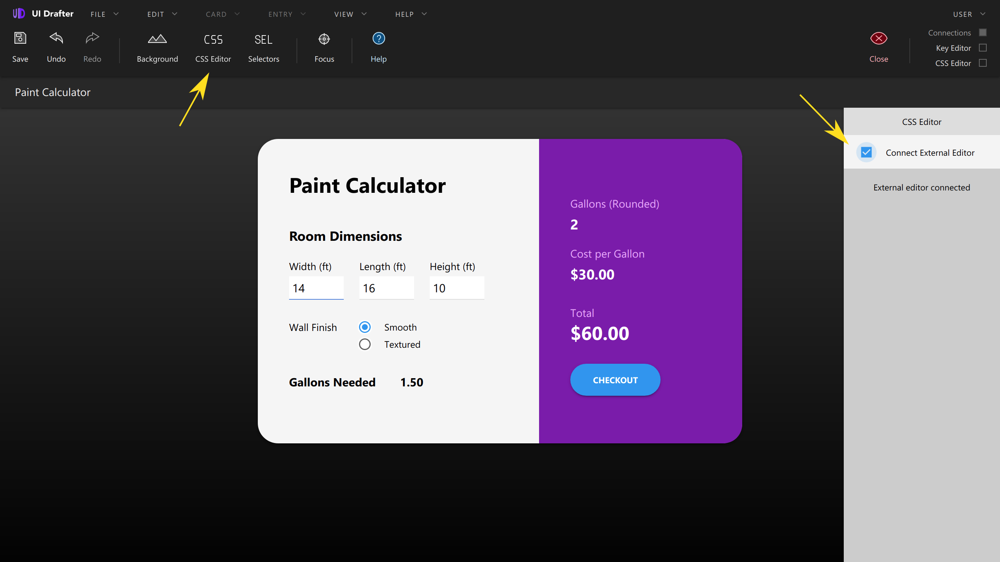

# CSS Editor Connector for UI&nbsp;Rig

This program is for styling [UI Rig](https://uirig.com) files from standalone
editors. Your edits will be hot-reloaded into your open UI Rig file.

Supports `.css`, `.less`, `.scss`

## Documentation
[https://docs.uirig.com/css-editor](https://docs.uirig.com/css-editor)


## Install
```shell script
git clone https://github.com/uxtely/css-editor-connector.git
cd css-editor-connector
npm install
```

## Usage Example
```shell script
./connect.js my-styles.less
```
Then, **Previewer** &rarr; **CSS Editor** &rarr; **Connect External Editor**



You can connect many UI Rigs, for example in different
browsers or sizes, and the changes will be pushed to all of them.

The program watches for stylesheet changes, and changes in its directory. Therefore,
imported sheets can trigger live-updates too, as long as they're within that directory.


## Troubleshooting
Error Code `EADDRINUSE` means conflict.
- Is another instance running? Only one active connector is supported.
- Is another program using port `29924` on your `localhost`?

Syntax Errors
- UI Rig shows _"Error with the stylesheet on the
External Editor Connector. Most likely is a syntax error."_
  - If you're using `.less` or `.scss` check the
  console, it will indicate where the error is.

## License
This program is [ISC licensed](./LICENSE).
